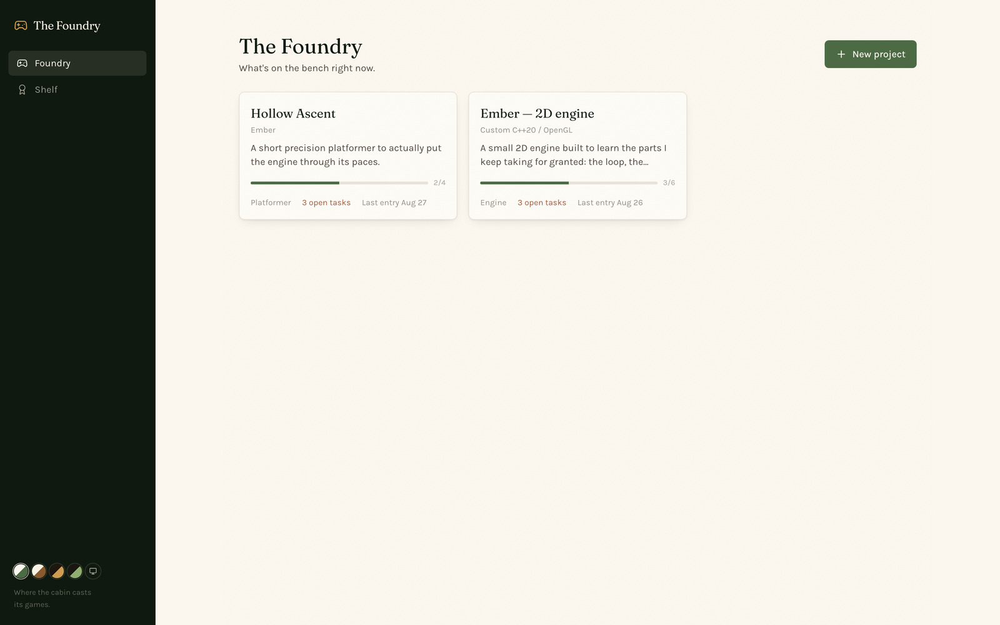

# The Foundry

> Where the cabin casts its games.

A project tracker for game development. Several projects can be in flight at once, each with its own milestones, backlog, devlog and build history — built for the reality that engine work, a game, and a jam entry all progress at different speeds.



## What it does

**Projects** carry an engine and genre as free text (`Custom C++20 / OpenGL`, `Godot 4`, `Unity 6 / C#`) and move through ACTIVE → PAUSED → SHIPPED or ABANDONED. Shipping or abandoning one asks for a retro — the honest record of what actually happened, kept with the project rather than lost.

**Milestones** are the ordered spine of a project. **Tasks** are the backlog, grouped by kind — feature, bug, asset, polish — because "10 open tasks" means something different when nine of them are art.

**Devlog** entries are a running log, not a daily standup: build notes, playtest observations, and things learned. Multiple a day is normal.

**Builds** are tagged, dated checkpoints — the versions that were actually playable.

**Shelf** links books from Reading Cabin to the project they're fuel for. The link is a soft cross-app reference: title, cover and progress are fetched live from Reading Cabin's API, never copied into this database.

## Stack

Next.js 16 (App Router) · React 19 · TypeScript · Tailwind 4 · Prisma + SQLite.

## Running it

```bash
npm install
npx prisma db push
npm run dev
```

Then open <http://localhost:3006>. The database lives at `~/Library/Application Support/The Foundry/the-foundry.db`, outside the repo.

## The cabin

Part of a set of local-first apps launched from [The Lodge](https://github.com/CamWhamBammus/the-lodge). Its sibling [The Forge](https://github.com/CamWhamBammus/the-forge) does the opposite thing on purpose: one project, one deadline, nothing else.
